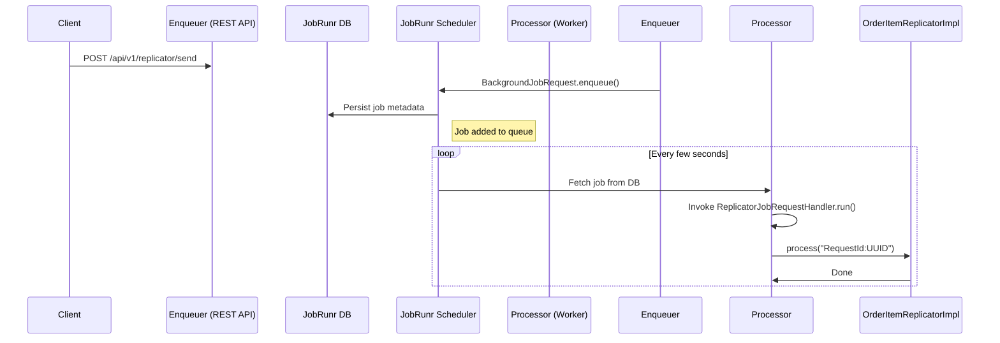

# 🚀 JobRunr Asynchronous Job Processing with Spring Boot & Docker

A sample multi-module Spring Boot application demonstrating how to use **JobRunr** for background job processing with **Java 21**, **Spring Boot 3**, and **Docker**.

---

## 📂 Project Structure

```
jobrunnr-example/
│
├── enquer/           # REST API to enqueue jobs
├── processor/        # Worker service to process jobs
├── jobCart/          # Shared job interfaces & DTOs
├── docker-compose.yml
└── pom.xml
```

---

## 🔧 Technologies Used

- Java 21
- Spring Boot 3.4.5
- JobRunr 7.5
- PostgreSQL (via Docker)
- Docker Compose
- Swagger (OpenAPI 3)
- Maven Multi-Module Build

---

## 📦 Modules

| Module     | Responsibility                           |
|------------|-------------------------------------------|
| `enquer`   | Exposes REST APIs to enqueue background jobs |
| `processor`| Background workers for executing jobs     |
| `jobCart`  | Common job interfaces and DTOs            |

---

## 🚀 Getting Started

### 1️⃣ Run with Docker

```bash
docker-compose up --build
```

> This will start:
> - PostgreSQL at `localhost:5432`
> - Enquer service at `localhost:8080`
> - Processor services at `localhost:8081`, `localhost:8082`
> - JobRunr dashboards (on processor containers) at `8001` and `8002`

---

## 🔗 Access Points

| Service             | URL                                   |
|---------------------|---------------------------------------|
| **Swagger (enquer)**   | http://localhost:8080/swagger-ui.html |
| **JobRunr Dashboard 1**| http://localhost:8001/dashboard       |
| **JobRunr Dashboard 2**| http://localhost:8002/dashboard                |

---

## ✅ Sample Endpoints

### Enqueue Single Job
```
POST /api/v1/replicator/send
```

### Enqueue Batch Jobs (10 parallel jobs)
```
POST /api/v1/replicator/send/batch
```

---

## 🔁 Sequence Diagram



---

## ⚖️ Why JobRunr?

| Feature                   | **JobRunr** ✅                    | **Quartz** 🟡          | **Spring Task Scheduler** ⚠️     |
|---------------------------|----------------------------------|------------------------|----------------------------------|
| **Ease of Use**           | Simple API, lambdas              | Complex setup          | Simple for one-off tasks         |
| **Persistence**           | Auto-persist in DB               | Manual JobStore config | In-memory only                   |
| **Built-in Dashboard**    | ✅ Yes (Port 8000)                | ❌ None                 | ❌ None                          |
| **Retries/Backoff**       | ✅ Built-in with annotations      | 🟡 Manual logic        | ❌ Manual                        |
| **Distributed Execution** | ✅ Native support (multi-worker)  | 🟡 Requires tuning     | ❌ Single JVM                    |
| **Job Composition**       | ✅ Via JobRequest handler pattern | ❌ Heavy XML/POJO       | ❌ Not supported                 |
| Developer Experience      | ✅ Modern                         | 🟡 Verbose             | ⚠️ Limited           |

---

## 📘 Recommendations

- ✅ Replace `System.out.println` with proper logging.
- ✅ Add job metadata like user ID, source system, etc.
- ✅ Containerize each module for Kubernetes deployment.
- ✅ Add Prometheus/Grafana metrics for observability.

---

## 📚 References

- [JobRunr Documentation](https://www.jobrunr.io/en/documentation/)
- [Spring Boot Documentation](https://docs.spring.io/spring-boot/)
- [Docker Compose Docs](https://docs.docker.com/compose/)

---
